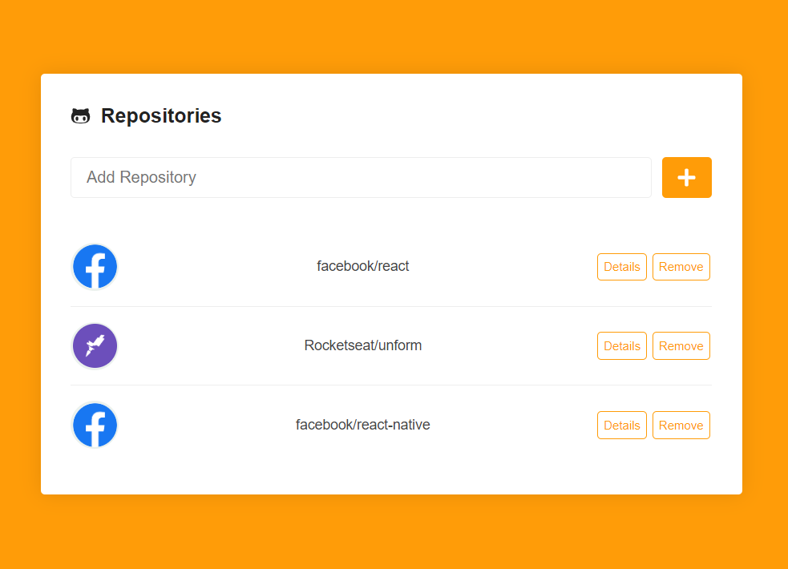

# React JS app - Github Repository List

This is a React JS app to add and list github repositories, users and issues. It works with the github API.



### Run the app

##### 1) Install dependencies

```
yarn
```

##### 2) Run the server

```
yarn dev
```

##### 3) Open the url `http://localhost:3000/`
